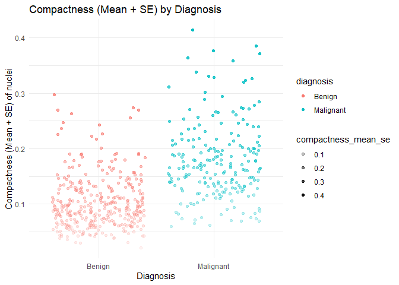
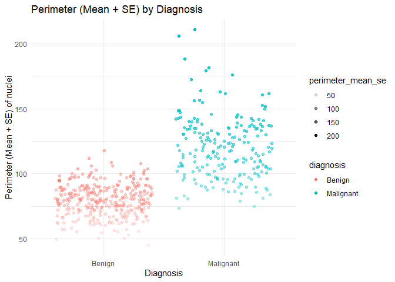
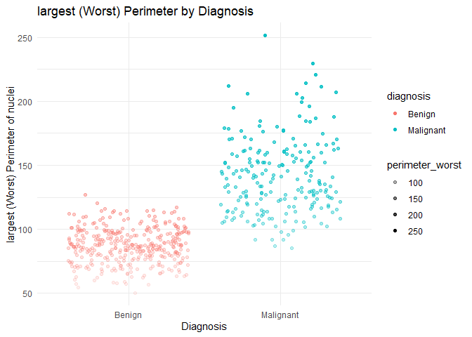
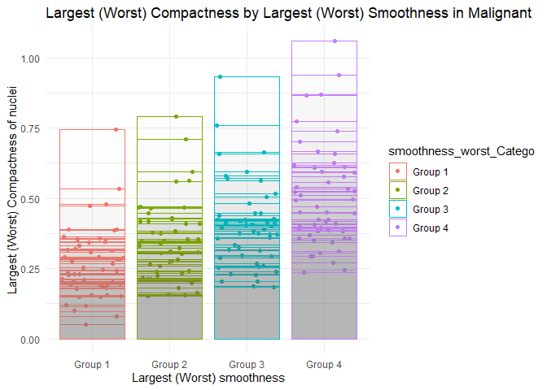

Mini Data Analysis Milestone 2
================

*To complete this milestone, you can either edit [this `.rmd`
file](https://raw.githubusercontent.com/UBC-STAT/stat545.stat.ubc.ca/master/content/mini-project/mini-project-2.Rmd)
directly. Fill in the sections that are commented out with
`<!--- start your work here--->`. When you are done, make sure to knit
to an `.md` file by changing the output in the YAML header to
`github_document`, before submitting a tagged release on canvas.*

# Welcome to the rest of your mini data analysis project!

In Milestone 1, you explored your data. and came up with research
questions. This time, we will finish up our mini data analysis and
obtain results for your data by:

- Making summary tables and graphs
- Manipulating special data types in R: factors and/or dates and times.
- Fitting a model object to your data, and extract a result.
- Reading and writing data as separate files.

We will also explore more in depth the concept of *tidy data.*

**NOTE**: The main purpose of the mini data analysis is to integrate
what you learn in class in an analysis. Although each milestone provides
a framework for you to conduct your analysis, it’s possible that you
might find the instructions too rigid for your data set. If this is the
case, you may deviate from the instructions – just make sure you’re
demonstrating a wide range of tools and techniques taught in this class.

# Instructions

**To complete this milestone**, edit [this very `.Rmd`
file](https://raw.githubusercontent.com/UBC-STAT/stat545.stat.ubc.ca/master/content/mini-project/mini-project-2.Rmd)
directly. Fill in the sections that are tagged with
`<!--- start your work here--->`.

**To submit this milestone**, make sure to knit this `.Rmd` file to an
`.md` file by changing the YAML output settings from
`output: html_document` to `output: github_document`. Commit and push
all of your work to your mini-analysis GitHub repository, and tag a
release on GitHub. Then, submit a link to your tagged release on canvas.

**Points**: This milestone is worth 50 points: 45 for your analysis, and
5 for overall reproducibility, cleanliness, and coherence of the Github
submission.

**Research Questions**: In Milestone 1, you chose two research questions
to focus on. Wherever realistic, your work in this milestone should
relate to these research questions whenever we ask for justification
behind your work. In the case that some tasks in this milestone don’t
align well with one of your research questions, feel free to discuss
your results in the context of a different research question.

# Learning Objectives

By the end of this milestone, you should:

- Understand what *tidy* data is, and how to create it using `tidyr`.
- Generate a reproducible and clear report using R Markdown.
- Manipulating special data types in R: factors and/or dates and times.
- Fitting a model object to your data, and extract a result.
- Reading and writing data as separate files.

# Setup

Begin by loading your data and the tidyverse package below:

``` r
library(datateachr) # <- might contain the data you picked!
library(tidyverse)
```

# Task 1: Process and summarize your data

From milestone 1, you should have an idea of the basic structure of your
dataset (e.g. number of rows and columns, class types, etc.). Here, we
will start investigating your data more in-depth using various data
manipulation functions.

### 1.1 (1 point)

First, write out the 4 research questions you defined in milestone 1
were. This will guide your work through milestone 2:

<!-------------------------- Start your work below ---------------------------->

##### My questions are:

> Question 1. Does the mean compactness of nuclei present in a sample
> image differ between malignant diagnosis samples and benign diagnosis
> samples?

> Question 2. Is there a difference in the mean perimeter of nuclei
> present in a sample image between malignant diagnosis samples and
> benign diagnosis samples?

> Question 3. Do malignant samples have the largest perimeter of nuclei
> present in the sample image compared to the benign samples?

> Question 4. In malignant samples, is there any association between the
> largest compactness of nuclei and the largest smoothness of nuclei?
> <!----------------------------------------------------------------------------->

Here, we will investigate your data using various data manipulation and
graphing functions.

### 1.2 (8 points)

Now, for each of your four research questions, choose one task from
options 1-4 (summarizing), and one other task from 4-8 (graphing). You
should have 2 tasks done for each research question (8 total). Make sure
it makes sense to do them! (e.g. don’t use a numerical variables for a
task that needs a categorical variable.). Comment on why each task helps
(or doesn’t!) answer the corresponding research question.

Ensure that the output of each operation is printed!

Also make sure that you’re using dplyr and ggplot2 rather than base R.
Outside of this project, you may find that you prefer using base R
functions for certain tasks, and that’s just fine! But part of this
project is for you to practice the tools we learned in class, which is
dplyr and ggplot2.

**Summarizing:**

1.  Compute the *range*, *mean*, and *two other summary statistics* of
    **one numerical variable** across the groups of **one categorical
    variable** from your data.
2.  Compute the number of observations for at least one of your
    categorical variables. Do not use the function `table()`!
3.  Create a categorical variable with 3 or more groups from an existing
    numerical variable. You can use this new variable in the other
    tasks! *An example: age in years into “child, teen, adult, senior”.*
4.  Compute the proportion and counts in each category of one
    categorical variable across the groups of another categorical
    variable from your data. Do not use the function `table()`!

**Graphing:**

6.  Create a graph of your choosing, make one of the axes logarithmic,
    and format the axes labels so that they are “pretty” or easier to
    read.
7.  Make a graph where it makes sense to customize the alpha
    transparency.

Using variables and/or tables you made in one of the “Summarizing”
tasks:

8.  Create a graph that has at least two geom layers.
9.  Create 3 histograms, with each histogram having different sized
    bins. Pick the “best” one and explain why it is the best.

Make sure it’s clear what research question you are doing each operation
for!

<!------------------------- Start your work below ----------------------------->

##### Question 1. Does the **mean compactness** of nuclei present in a sample image differ between *malignant diagnosis* samples and *benign diagnosis* samples?

**Q1.Summarizing:** Compute the *range*, *mean*, and *two other summary
statistics* of **one numerical variable** across the groups of **one
categorical variable** from your data.
<!----------------------------------------------------------------------------->

``` r
#load and define the dataset; also I added the standard error to the corresponding mean for further analysis plus add the complete name of diagnosis rather the abbreviation
cancer_sample
```

    ## # A tibble: 569 × 32
    ##          ID diagnosis radius_mean texture_mean perimeter_mean area_mean
    ##       <dbl> <chr>           <dbl>        <dbl>          <dbl>     <dbl>
    ##  1   842302 M                18.0         10.4          123.      1001 
    ##  2   842517 M                20.6         17.8          133.      1326 
    ##  3 84300903 M                19.7         21.2          130       1203 
    ##  4 84348301 M                11.4         20.4           77.6      386.
    ##  5 84358402 M                20.3         14.3          135.      1297 
    ##  6   843786 M                12.4         15.7           82.6      477.
    ##  7   844359 M                18.2         20.0          120.      1040 
    ##  8 84458202 M                13.7         20.8           90.2      578.
    ##  9   844981 M                13           21.8           87.5      520.
    ## 10 84501001 M                12.5         24.0           84.0      476.
    ## # ℹ 559 more rows
    ## # ℹ 26 more variables: smoothness_mean <dbl>, compactness_mean <dbl>,
    ## #   concavity_mean <dbl>, concave_points_mean <dbl>, symmetry_mean <dbl>,
    ## #   fractal_dimension_mean <dbl>, radius_se <dbl>, texture_se <dbl>,
    ## #   perimeter_se <dbl>, area_se <dbl>, smoothness_se <dbl>,
    ## #   compactness_se <dbl>, concavity_se <dbl>, concave_points_se <dbl>,
    ## #   symmetry_se <dbl>, fractal_dimension_se <dbl>, radius_worst <dbl>, …

``` r
dataset <- cancer_sample %>%
  mutate(
    radius_mean_se = radius_mean + radius_se,
    texture_mean_se = texture_mean + texture_se,
    perimeter_mean_se = perimeter_mean + perimeter_se,
    area_mean_se = area_mean + area_se,
    smoothness_mean_se = smoothness_mean + smoothness_se,
    compactness_mean_se = compactness_mean + compactness_se,
    concavity_mean_se = concavity_mean + concavity_se,
    concave_point_mean_se = concave_points_mean + concave_points_se,
    symmetry_mean_se = symmetry_mean + symmetry_se,
    fractal_dimension_mean_se = fractal_dimension_mean + fractal_dimension_se) %>%
  mutate(diagnosis = ifelse(diagnosis == "B", "Benign", ifelse(diagnosis == "M", "Malignant", diagnosis)))
print(dataset)
```

    ## # A tibble: 569 × 42
    ##          ID diagnosis radius_mean texture_mean perimeter_mean area_mean
    ##       <dbl> <chr>           <dbl>        <dbl>          <dbl>     <dbl>
    ##  1   842302 Malignant        18.0         10.4          123.      1001 
    ##  2   842517 Malignant        20.6         17.8          133.      1326 
    ##  3 84300903 Malignant        19.7         21.2          130       1203 
    ##  4 84348301 Malignant        11.4         20.4           77.6      386.
    ##  5 84358402 Malignant        20.3         14.3          135.      1297 
    ##  6   843786 Malignant        12.4         15.7           82.6      477.
    ##  7   844359 Malignant        18.2         20.0          120.      1040 
    ##  8 84458202 Malignant        13.7         20.8           90.2      578.
    ##  9   844981 Malignant        13           21.8           87.5      520.
    ## 10 84501001 Malignant        12.5         24.0           84.0      476.
    ## # ℹ 559 more rows
    ## # ℹ 36 more variables: smoothness_mean <dbl>, compactness_mean <dbl>,
    ## #   concavity_mean <dbl>, concave_points_mean <dbl>, symmetry_mean <dbl>,
    ## #   fractal_dimension_mean <dbl>, radius_se <dbl>, texture_se <dbl>,
    ## #   perimeter_se <dbl>, area_se <dbl>, smoothness_se <dbl>,
    ## #   compactness_se <dbl>, concavity_se <dbl>, concave_points_se <dbl>,
    ## #   symmetry_se <dbl>, fractal_dimension_se <dbl>, radius_worst <dbl>, …

``` r
# Selected only malignant diagnosis as a categorical variable and compute range,mean, standard deviation, and median: helpful to show us compactness in malignant samples since the question is about the difference of compactness_mean_se between malignant and benign.
Malignant <- dataset %>%
  filter(diagnosis == "Malignant")
print(Malignant)
```

    ## # A tibble: 212 × 42
    ##          ID diagnosis radius_mean texture_mean perimeter_mean area_mean
    ##       <dbl> <chr>           <dbl>        <dbl>          <dbl>     <dbl>
    ##  1   842302 Malignant        18.0         10.4          123.      1001 
    ##  2   842517 Malignant        20.6         17.8          133.      1326 
    ##  3 84300903 Malignant        19.7         21.2          130       1203 
    ##  4 84348301 Malignant        11.4         20.4           77.6      386.
    ##  5 84358402 Malignant        20.3         14.3          135.      1297 
    ##  6   843786 Malignant        12.4         15.7           82.6      477.
    ##  7   844359 Malignant        18.2         20.0          120.      1040 
    ##  8 84458202 Malignant        13.7         20.8           90.2      578.
    ##  9   844981 Malignant        13           21.8           87.5      520.
    ## 10 84501001 Malignant        12.5         24.0           84.0      476.
    ## # ℹ 202 more rows
    ## # ℹ 36 more variables: smoothness_mean <dbl>, compactness_mean <dbl>,
    ## #   concavity_mean <dbl>, concave_points_mean <dbl>, symmetry_mean <dbl>,
    ## #   fractal_dimension_mean <dbl>, radius_se <dbl>, texture_se <dbl>,
    ## #   perimeter_se <dbl>, area_se <dbl>, smoothness_se <dbl>,
    ## #   compactness_se <dbl>, concavity_se <dbl>, concave_points_se <dbl>,
    ## #   symmetry_se <dbl>, fractal_dimension_se <dbl>, radius_worst <dbl>, …

``` r
#range of compactness_mean_se in malignant
range_compactness_mean_se <- range(Malignant$compactness_mean_se)
print(range_compactness_mean_se)
```

    ## [1] 0.06032 0.41375

``` r
#mean of compactness_mean_se in malignant
mean_compactness_mean_se <- mean(Malignant$compactness_mean_se)
print(mean_compactness_mean_se)
```

    ## [1] 0.1774689

``` r
#Standard deviation of compactness_mean_se in malignant
sd_range_compactness_mean_se <- sd(Malignant$compactness_mean_se)
print(sd_range_compactness_mean_se)
```

    ## [1] 0.06882869

``` r
#median of compactness_mean_se in malignant
median_range_compactness_mean_se <- median(Malignant$compactness_mean_se)
print(median_range_compactness_mean_se)
```

    ## [1] 0.166155

**Q1. Graphing:** Make a graph where it makes sense to customize the
alpha transparency.

``` r
#Loadding the package
library(ggplot2)

dataset
```

    ## # A tibble: 569 × 42
    ##          ID diagnosis radius_mean texture_mean perimeter_mean area_mean
    ##       <dbl> <chr>           <dbl>        <dbl>          <dbl>     <dbl>
    ##  1   842302 Malignant        18.0         10.4          123.      1001 
    ##  2   842517 Malignant        20.6         17.8          133.      1326 
    ##  3 84300903 Malignant        19.7         21.2          130       1203 
    ##  4 84348301 Malignant        11.4         20.4           77.6      386.
    ##  5 84358402 Malignant        20.3         14.3          135.      1297 
    ##  6   843786 Malignant        12.4         15.7           82.6      477.
    ##  7   844359 Malignant        18.2         20.0          120.      1040 
    ##  8 84458202 Malignant        13.7         20.8           90.2      578.
    ##  9   844981 Malignant        13           21.8           87.5      520.
    ## 10 84501001 Malignant        12.5         24.0           84.0      476.
    ## # ℹ 559 more rows
    ## # ℹ 36 more variables: smoothness_mean <dbl>, compactness_mean <dbl>,
    ## #   concavity_mean <dbl>, concave_points_mean <dbl>, symmetry_mean <dbl>,
    ## #   fractal_dimension_mean <dbl>, radius_se <dbl>, texture_se <dbl>,
    ## #   perimeter_se <dbl>, area_se <dbl>, smoothness_se <dbl>,
    ## #   compactness_se <dbl>, concavity_se <dbl>, concave_points_se <dbl>,
    ## #   symmetry_se <dbl>, fractal_dimension_se <dbl>, radius_worst <dbl>, …

``` r
#plot : this analysis help us to have better idea to see the compactness_mean_se difference between malignant and benign samples.
plot_Q1 <- ggplot(dataset, aes(x = diagnosis, y = compactness_mean_se, color = diagnosis)) +
  geom_jitter(aes(alpha = compactness_mean_se)) +
  labs(
    title = "Compactness (Mean + SE) by Diagnosis",
    x = "Diagnosis",
    y = "Compactness (Mean + SE) of nuclei"
  )+
  theme_minimal()
print(plot_Q1)
```

<!-- -->

##### Question 2. Is there a difference in the **mean perimeter** of nuclei present in a sample image between *malignant* diagnosis samples and *benign* diagnosis samples?

**Q2.Summarizing:** Compute the *range*, *mean*, and *two other summary
statistics* of **one numerical variable** across the groups of **one
categorical variable** from your data.

``` r
# Selected only Benign diagnosis as a categorical variable and compute range,mean, standard deviation, and median of perimeter_mean_se: gives me better idea to compare this variable between malignant and benign specimens.
Benign <- dataset %>%
  filter(diagnosis == "Benign")
print(Benign)
```

    ## # A tibble: 357 × 42
    ##          ID diagnosis radius_mean texture_mean perimeter_mean area_mean
    ##       <dbl> <chr>           <dbl>        <dbl>          <dbl>     <dbl>
    ##  1  8510426 Benign          13.5          14.4           87.5      566.
    ##  2  8510653 Benign          13.1          15.7           85.6      520 
    ##  3  8510824 Benign           9.50         12.4           60.3      274.
    ##  4   854941 Benign          13.0          18.4           82.6      524.
    ##  5 85713702 Benign           8.20         16.8           51.7      202.
    ##  6   857155 Benign          12.0          14.6           78.0      449.
    ##  7   857156 Benign          13.5          22.3           86.9      561 
    ##  8   857343 Benign          11.8          21.6           74.7      428.
    ##  9   857373 Benign          13.6          16.3           87.2      572.
    ## 10   857374 Benign          11.9          18.2           75.7      438.
    ## # ℹ 347 more rows
    ## # ℹ 36 more variables: smoothness_mean <dbl>, compactness_mean <dbl>,
    ## #   concavity_mean <dbl>, concave_points_mean <dbl>, symmetry_mean <dbl>,
    ## #   fractal_dimension_mean <dbl>, radius_se <dbl>, texture_se <dbl>,
    ## #   perimeter_se <dbl>, area_se <dbl>, smoothness_se <dbl>,
    ## #   compactness_se <dbl>, concavity_se <dbl>, concave_points_se <dbl>,
    ## #   symmetry_se <dbl>, fractal_dimension_se <dbl>, radius_worst <dbl>, …

``` r
#range of perimeter_mean_se in Benign patients.
range_perimeter_mean_se <- range(Benign$perimeter_mean_se)
print(range_perimeter_mean_se)
```

    ## [1]  45.343 117.763

``` r
#mean of perimeter_mean_se in Benign patients.
mean_perimeter_mean_se <- mean(Benign$perimeter_mean_se)
print(mean_perimeter_mean_se)
```

    ## [1] 80.07573

``` r
#Standard deviation of perimeter_mean_se in Benign patients.
sd_perimeter_mean_se <- sd(Benign$perimeter_mean_se)
print(sd_perimeter_mean_se)
```

    ## [1] 11.85682

``` r
#median of perimeter_mean_se in Benign patients.
median_perimeter_mean_se <- median(Benign$perimeter_mean_se)
print(median_perimeter_mean_se)
```

    ## [1] 80.184

**Q2. Graphing:** Make a graph where it makes sense to customize the
alpha transparency.

``` r
#Loadding the package
library(ggplot2)
dataset
```

    ## # A tibble: 569 × 42
    ##          ID diagnosis radius_mean texture_mean perimeter_mean area_mean
    ##       <dbl> <chr>           <dbl>        <dbl>          <dbl>     <dbl>
    ##  1   842302 Malignant        18.0         10.4          123.      1001 
    ##  2   842517 Malignant        20.6         17.8          133.      1326 
    ##  3 84300903 Malignant        19.7         21.2          130       1203 
    ##  4 84348301 Malignant        11.4         20.4           77.6      386.
    ##  5 84358402 Malignant        20.3         14.3          135.      1297 
    ##  6   843786 Malignant        12.4         15.7           82.6      477.
    ##  7   844359 Malignant        18.2         20.0          120.      1040 
    ##  8 84458202 Malignant        13.7         20.8           90.2      578.
    ##  9   844981 Malignant        13           21.8           87.5      520.
    ## 10 84501001 Malignant        12.5         24.0           84.0      476.
    ## # ℹ 559 more rows
    ## # ℹ 36 more variables: smoothness_mean <dbl>, compactness_mean <dbl>,
    ## #   concavity_mean <dbl>, concave_points_mean <dbl>, symmetry_mean <dbl>,
    ## #   fractal_dimension_mean <dbl>, radius_se <dbl>, texture_se <dbl>,
    ## #   perimeter_se <dbl>, area_se <dbl>, smoothness_se <dbl>,
    ## #   compactness_se <dbl>, concavity_se <dbl>, concave_points_se <dbl>,
    ## #   symmetry_se <dbl>, fractal_dimension_se <dbl>, radius_worst <dbl>, …

``` r
#plot: this analysis help us to have better idea to see the perimeter_mean_se difference between malignant and benign samples.
plot_Q2 <- ggplot(dataset, aes(x = diagnosis, y = perimeter_mean_se, color = diagnosis)) +
  geom_jitter(aes(alpha = perimeter_mean_se)) +
  labs(
    title = "Perimeter (Mean + SE) by Diagnosis",
    x = "Diagnosis",
    y = "Perimeter (Mean + SE) of nuclei"
  )+
  theme_minimal()
print(plot_Q2)
```

<!-- -->

##### Question 3. Do *malignant samples* have the **largest perimeter** of nuclei present in the sample image compared to the *benign* samples?

**Q3.Summarizing:** Compute the *range*, *mean*, and *two other summary
statistics* of **one numerical variable** across the groups of **one
categorical variable** from your data.

``` r
#Producing a new dataset only contain perimeter data called perimeter_dataset from malignant dataset: only have the variable for malignant patients.
perimeter_Malignant <- Malignant %>%  
  select(diagnosis, perimeter_mean, perimeter_se, perimeter_mean_se, perimeter_worst)
print(perimeter_Malignant)
```

    ## # A tibble: 212 × 5
    ##    diagnosis perimeter_mean perimeter_se perimeter_mean_se perimeter_worst
    ##    <chr>              <dbl>        <dbl>             <dbl>           <dbl>
    ##  1 Malignant          123.          8.59             131.            185. 
    ##  2 Malignant          133.          3.40             136.            159. 
    ##  3 Malignant          130           4.58             135.            152. 
    ##  4 Malignant           77.6         3.44              81.0            98.9
    ##  5 Malignant          135.          5.44             141.            152. 
    ##  6 Malignant           82.6         2.22              84.8           103. 
    ##  7 Malignant          120.          3.18             123.            153. 
    ##  8 Malignant           90.2         3.86              94.1           111. 
    ##  9 Malignant           87.5         2.41              89.9           106. 
    ## 10 Malignant           84.0         2.04              86.0            97.6
    ## # ℹ 202 more rows

``` r
# based on the description of the main datasheet(cancer_sample), perimeter_worst is "Worst" or largest perimeter of nuclei present in sample image. so for answering the question number 3, I should consider perimeter_worst variable as the largest perimeter of nuclei present in the sample image.
  
#range of perimeter_worst in Malignant dataset
range_perimeter_worst <- range(perimeter_Malignant$perimeter_worst)
print(range_perimeter_worst)
```

    ## [1]  85.1 251.2

``` r
#mean of perimeter_worst in Malignant dataset
mean_perimeter_worst <- mean(perimeter_Malignant$perimeter_worst)
print(mean_perimeter_worst)
```

    ## [1] 141.3703

``` r
#Standard deviation of perimeter_worst in Malignant dataset
sd_perimeter_worst <- sd(perimeter_Malignant$perimeter_worst)
print(sd_perimeter_worst)
```

    ## [1] 29.45706

``` r
#median of perimeter_worst in Malignant dataset
median_perimeter_worst <- median(perimeter_Malignant$perimeter_worst)
print(median_perimeter_worst)
```

    ## [1] 138

**Q3. Graphing:** Make a graph where it makes sense to customize the
alpha transparency.

``` r
#Loadding the package
library(ggplot2)

#Producing a new dataset only contain perimeter data called perimeter_dataset for both patients: malignant and benign
perimeter_dataset <- dataset %>%  
  select(diagnosis, perimeter_mean, perimeter_se, perimeter_mean_se, perimeter_worst)
print(perimeter_dataset)
```

    ## # A tibble: 569 × 5
    ##    diagnosis perimeter_mean perimeter_se perimeter_mean_se perimeter_worst
    ##    <chr>              <dbl>        <dbl>             <dbl>           <dbl>
    ##  1 Malignant          123.          8.59             131.            185. 
    ##  2 Malignant          133.          3.40             136.            159. 
    ##  3 Malignant          130           4.58             135.            152. 
    ##  4 Malignant           77.6         3.44              81.0            98.9
    ##  5 Malignant          135.          5.44             141.            152. 
    ##  6 Malignant           82.6         2.22              84.8           103. 
    ##  7 Malignant          120.          3.18             123.            153. 
    ##  8 Malignant           90.2         3.86              94.1           111. 
    ##  9 Malignant           87.5         2.41              89.9           106. 
    ## 10 Malignant           84.0         2.04              86.0            97.6
    ## # ℹ 559 more rows

``` r
# based on the description of the main data set(cancer_sample), perimeter_worst is "Worst" or largest perimeter of nuclei present in sample image.
#plot: this analysis help us to have better idea to see the perimeter_worst (largest) difference between malignant and benign samples.
plot_Q3 <- ggplot(perimeter_dataset, aes(x = diagnosis, y = perimeter_worst, color = diagnosis)) +
  geom_jitter(aes(alpha = perimeter_worst)) +
  labs(
    title = "largest (Worst) Perimeter by Diagnosis",
    x = "Diagnosis",
    y = "largest (Worst) Perimeter of nuclei"
  )+
  theme_minimal()
print(plot_Q3)
```

<!-- -->

##### Question 4. In *malignant* samples, is there any association between the **largest compactness** of nuclei and the **largest smoothness** of nuclei?

**Q4.Summarizing:** Create a categorical variable with 3 or more groups
from an existing numerical variable. You can use this new variable in
the other tasks! An example: age in years into “child, teen, adult,
senior”.

``` r
Malignant
```

    ## # A tibble: 212 × 42
    ##          ID diagnosis radius_mean texture_mean perimeter_mean area_mean
    ##       <dbl> <chr>           <dbl>        <dbl>          <dbl>     <dbl>
    ##  1   842302 Malignant        18.0         10.4          123.      1001 
    ##  2   842517 Malignant        20.6         17.8          133.      1326 
    ##  3 84300903 Malignant        19.7         21.2          130       1203 
    ##  4 84348301 Malignant        11.4         20.4           77.6      386.
    ##  5 84358402 Malignant        20.3         14.3          135.      1297 
    ##  6   843786 Malignant        12.4         15.7           82.6      477.
    ##  7   844359 Malignant        18.2         20.0          120.      1040 
    ##  8 84458202 Malignant        13.7         20.8           90.2      578.
    ##  9   844981 Malignant        13           21.8           87.5      520.
    ## 10 84501001 Malignant        12.5         24.0           84.0      476.
    ## # ℹ 202 more rows
    ## # ℹ 36 more variables: smoothness_mean <dbl>, compactness_mean <dbl>,
    ## #   concavity_mean <dbl>, concave_points_mean <dbl>, symmetry_mean <dbl>,
    ## #   fractal_dimension_mean <dbl>, radius_se <dbl>, texture_se <dbl>,
    ## #   perimeter_se <dbl>, area_se <dbl>, smoothness_se <dbl>,
    ## #   compactness_se <dbl>, concavity_se <dbl>, concave_points_se <dbl>,
    ## #   symmetry_se <dbl>, fractal_dimension_se <dbl>, radius_worst <dbl>, …

``` r
# based on the description of the main dataset(cancer_sample), compactness_worst and smoothness_worst are "Worst" or largest compactness and "Worst" or largest smoothness of nuclei present in sample image, respectively.
# for answering question 4, I would like to have a new dataset only focus on "Worst" variables in malignant patients since help me to address this question (Q4) better.

Malignant_worst_data <- Malignant %>%
  select(
    ID,
    diagnosis,
    radius_worst,
    texture_worst,
    perimeter_worst,
    area_worst,
    smoothness_worst,
    compactness_worst,
    concavity_worst,
    concave_points_worst,
    symmetry_worst,
    fractal_dimension_worst) %>%
  filter(diagnosis == "Malignant")
print(Malignant_worst_data)
```

    ## # A tibble: 212 × 12
    ##          ID diagnosis radius_worst texture_worst perimeter_worst area_worst
    ##       <dbl> <chr>            <dbl>         <dbl>           <dbl>      <dbl>
    ##  1   842302 Malignant         25.4          17.3           185.       2019 
    ##  2   842517 Malignant         25.0          23.4           159.       1956 
    ##  3 84300903 Malignant         23.6          25.5           152.       1709 
    ##  4 84348301 Malignant         14.9          26.5            98.9       568.
    ##  5 84358402 Malignant         22.5          16.7           152.       1575 
    ##  6   843786 Malignant         15.5          23.8           103.        742.
    ##  7   844359 Malignant         22.9          27.7           153.       1606 
    ##  8 84458202 Malignant         17.1          28.1           111.        897 
    ##  9   844981 Malignant         15.5          30.7           106.        739.
    ## 10 84501001 Malignant         15.1          40.7            97.6       711.
    ## # ℹ 202 more rows
    ## # ℹ 6 more variables: smoothness_worst <dbl>, compactness_worst <dbl>,
    ## #   concavity_worst <dbl>, concave_points_worst <dbl>, symmetry_worst <dbl>,
    ## #   fractal_dimension_worst <dbl>

``` r
# I would like to create four groups within the variable "smoothness_worst" based on its quartiles; this sorting helps me to have better view regaring the relationship between smoothness_worst and compactness_worst in only malignant samples.


# quartile 1 (First Quartile) of smoothness_worst in malignant samples
Q1 <- quantile(Malignant_worst_data$smoothness_worst, probs = 0.25)
print(Q1)
```

    ##      25% 
    ## 0.130475

``` r
#Median or Q2 of smoothness_worst in malignant samples
Q2 <- median(Malignant_worst_data$smoothness_worst)
print(Q2)
```

    ## [1] 0.14345

``` r
# quartile 3 (Third Quartile) of smoothness_worst in malignant samples
Q3 <- quantile(Malignant_worst_data$smoothness_worst, probs = 0.75)
print(Q3)
```

    ##      75% 
    ## 0.155975

``` r
# make new dataset Create a categorical variable from smoothness_worst
New_Malignant_worst_data <- Malignant_worst_data %>% 
  mutate(smoothness_worst_Catego = case_when(
    smoothness_worst <= Q1 ~ "Group 1",  # Group 1 is equal and less than Q1 of smoothness_worst
    smoothness_worst > Q1 & smoothness_worst <= Q2 ~ "Group 2",  # Group2 is between more than Q1 and equal and less than median(Q2) of smoothness_worst
    smoothness_worst > Q2 & smoothness_worst <= Q3 ~ "Group 3",   # Group3 is between more than Q2 (median) and equal and less than Q3 of smoothness_worst.
    smoothness_worst > Q3 ~ "Group 4"   # Group4 is more than Q3 of smoothness_worst.
  ))
print(New_Malignant_worst_data)
```

    ## # A tibble: 212 × 13
    ##          ID diagnosis radius_worst texture_worst perimeter_worst area_worst
    ##       <dbl> <chr>            <dbl>         <dbl>           <dbl>      <dbl>
    ##  1   842302 Malignant         25.4          17.3           185.       2019 
    ##  2   842517 Malignant         25.0          23.4           159.       1956 
    ##  3 84300903 Malignant         23.6          25.5           152.       1709 
    ##  4 84348301 Malignant         14.9          26.5            98.9       568.
    ##  5 84358402 Malignant         22.5          16.7           152.       1575 
    ##  6   843786 Malignant         15.5          23.8           103.        742.
    ##  7   844359 Malignant         22.9          27.7           153.       1606 
    ##  8 84458202 Malignant         17.1          28.1           111.        897 
    ##  9   844981 Malignant         15.5          30.7           106.        739.
    ## 10 84501001 Malignant         15.1          40.7            97.6       711.
    ## # ℹ 202 more rows
    ## # ℹ 7 more variables: smoothness_worst <dbl>, compactness_worst <dbl>,
    ## #   concavity_worst <dbl>, concave_points_worst <dbl>, symmetry_worst <dbl>,
    ## #   fractal_dimension_worst <dbl>, smoothness_worst_Catego <chr>

**Q4. Graphing:** Create a graph that has at least two geom layers.

``` r
library(ggplot2)

#plot: this analysis help us to have better idea to see relationship between compactness_worst and smoothness_worst in malignant samples.
# in this plot: I grouped Largest (Worst) smoothness in malignant patients to four groups based on the quartiles as shown below.
#Group 1: minimum to and equal first quartile of data [M, Q1] include both minimum and  first quartile
#Group 2: first quartile to and equal median (Q1, Median] include median and not quartile one
#Group 3: median to and equal third quartile (Median, Q3] include quartile 3 and not median
#Group 4: third quartile to and equal maximum (Q3, Maximum] include maximum and not quartile 3.

plot_Q4 <- ggplot(New_Malignant_worst_data, aes(x = smoothness_worst_Catego, y = compactness_worst, color = smoothness_worst_Catego)) +
  geom_jitter() +
  geom_bar(stat = "identity", position = "dodge", alpha = 0.01, width = 0.85) + 
  labs(
    title = "Largest (Worst) Compactness by Largest (Worst) Smoothness in Malignant",
    x = "Largest (Worst) smoothness",
    y = "Largest (Worst) Compactness of nuclei"
  ) +
  theme_minimal()
print(plot_Q4)
```

<!-- -->

### 1.3 (2 points)

Based on the operations that you’ve completed, how much closer are you
to answering your research questions? Think about what aspects of your
research questions remain unclear. Can your research questions be
refined, now that you’ve investigated your data a bit more? Which
research questions are yielding interesting results?

<!------------------------- Write your answer here ---------------------------->

Based on the operations that I’ve completed, I have made significant
progress in addressing my research questions. The data analysis and
visualization tasks have provided valuable insights and a better
understanding of the research questions; the work completed so far has
brought me closer to the research objectives, which is finding the
difference between **malignant** patients and **benign** patients in the
aforementioned variables in the questions.

After delving into the data, several aspects of my research questions
still appear unclear. It is evident that further refinement is necessary
to effectively address these uncertainties. For example, I need to focus
more on the **malignant** patients and investigate the association
between variables containing *‘Worst’* or the largest values.

The most interesting results to me; it appears that not only do
malignant patients exhibit higher values for both perimeter and
compactness of nuclei compared to benign patients, but this difference
is more pronounced when considering the *‘Worst’* or largest perimeter
of nuclei among these two types of patients (**Malignant** vs
**Benign**) and also there might be association between difference
variables within a diagnosis group in particular **malignant** patients.

<!----------------------------------------------------------------------------->

# Task 2: Tidy your data

In this task, we will do several exercises to reshape our data. The goal
here is to understand how to do this reshaping with the `tidyr` package.

A reminder of the definition of *tidy* data:

- Each row is an **observation**
- Each column is a **variable**
- Each cell is a **value**

### 2.1 (2 points)

Based on the definition above, can you identify if your data is tidy or
untidy? Go through all your columns, or if you have \>8 variables, just
pick 8, and explain whether the data is untidy or tidy.

<!--------------------------- Start your work below --------------------------->

``` r
cancer_sample
```

    ## # A tibble: 569 × 32
    ##          ID diagnosis radius_mean texture_mean perimeter_mean area_mean
    ##       <dbl> <chr>           <dbl>        <dbl>          <dbl>     <dbl>
    ##  1   842302 M                18.0         10.4          123.      1001 
    ##  2   842517 M                20.6         17.8          133.      1326 
    ##  3 84300903 M                19.7         21.2          130       1203 
    ##  4 84348301 M                11.4         20.4           77.6      386.
    ##  5 84358402 M                20.3         14.3          135.      1297 
    ##  6   843786 M                12.4         15.7           82.6      477.
    ##  7   844359 M                18.2         20.0          120.      1040 
    ##  8 84458202 M                13.7         20.8           90.2      578.
    ##  9   844981 M                13           21.8           87.5      520.
    ## 10 84501001 M                12.5         24.0           84.0      476.
    ## # ℹ 559 more rows
    ## # ℹ 26 more variables: smoothness_mean <dbl>, compactness_mean <dbl>,
    ## #   concavity_mean <dbl>, concave_points_mean <dbl>, symmetry_mean <dbl>,
    ## #   fractal_dimension_mean <dbl>, radius_se <dbl>, texture_se <dbl>,
    ## #   perimeter_se <dbl>, area_se <dbl>, smoothness_se <dbl>,
    ## #   compactness_se <dbl>, concavity_se <dbl>, concave_points_se <dbl>,
    ## #   symmetry_se <dbl>, fractal_dimension_se <dbl>, radius_worst <dbl>, …

``` r
First_8_variables <- cancer_sample[, 1:8]
print(First_8_variables)
```

    ## # A tibble: 569 × 8
    ##          ID diagnosis radius_mean texture_mean perimeter_mean area_mean
    ##       <dbl> <chr>           <dbl>        <dbl>          <dbl>     <dbl>
    ##  1   842302 M                18.0         10.4          123.      1001 
    ##  2   842517 M                20.6         17.8          133.      1326 
    ##  3 84300903 M                19.7         21.2          130       1203 
    ##  4 84348301 M                11.4         20.4           77.6      386.
    ##  5 84358402 M                20.3         14.3          135.      1297 
    ##  6   843786 M                12.4         15.7           82.6      477.
    ##  7   844359 M                18.2         20.0          120.      1040 
    ##  8 84458202 M                13.7         20.8           90.2      578.
    ##  9   844981 M                13           21.8           87.5      520.
    ## 10 84501001 M                12.5         24.0           84.0      476.
    ## # ℹ 559 more rows
    ## # ℹ 2 more variables: smoothness_mean <dbl>, compactness_mean <dbl>

Based on ***the first 8 variables*** of data set (cancer_sample), this
dataset is *tidy* because:

> 1.  Each variable is in its own column: The data is structured so that
>     each attribute occupies a dedicated column.

> 2.  Each row represents a unique observation: Every row contains
>     distinct and self-contained information.

> 3.  Different types of data are organized into separate tables: The
>     dataset is organized in a way that keeps various observational
>     units in their own clearly defined tables.

These characteristics make the dataset clear, organized, and suitable
for easy analysis and manipulation.

<!----------------------------------------------------------------------------->

### 2.2 (4 points)

Now, if your data is tidy, untidy it! Then, tidy it back to it’s
original state.

If your data is untidy, then tidy it! Then, untidy it back to it’s
original state.

Be sure to explain your reasoning for this task. Show us the “before”
and “after”.

<!--------------------------- Start your work below --------------------------->

#### make untidy the dataset by makeing wider

``` r
library(tidyr)
# since I considered the first 8 variables of the dataset for tidy/untidy assessment, I am going to work on the first 8 variables of the dataset.
First_8_variables
```

    ## # A tibble: 569 × 8
    ##          ID diagnosis radius_mean texture_mean perimeter_mean area_mean
    ##       <dbl> <chr>           <dbl>        <dbl>          <dbl>     <dbl>
    ##  1   842302 M                18.0         10.4          123.      1001 
    ##  2   842517 M                20.6         17.8          133.      1326 
    ##  3 84300903 M                19.7         21.2          130       1203 
    ##  4 84348301 M                11.4         20.4           77.6      386.
    ##  5 84358402 M                20.3         14.3          135.      1297 
    ##  6   843786 M                12.4         15.7           82.6      477.
    ##  7   844359 M                18.2         20.0          120.      1040 
    ##  8 84458202 M                13.7         20.8           90.2      578.
    ##  9   844981 M                13           21.8           87.5      520.
    ## 10 84501001 M                12.5         24.0           84.0      476.
    ## # ℹ 559 more rows
    ## # ℹ 2 more variables: smoothness_mean <dbl>, compactness_mean <dbl>

``` r
# Make untidy the data by making wider the dataset (First_8_variables) through adding malignant and benign to each variables.
After <- First_8_variables %>%
  pivot_wider(names_from = diagnosis, values_from = radius_mean:compactness_mean)
print(After)
```

    ## # A tibble: 569 × 13
    ##          ID radius_mean_M radius_mean_B texture_mean_M texture_mean_B
    ##       <dbl>         <dbl>         <dbl>          <dbl>          <dbl>
    ##  1   842302          18.0            NA           10.4             NA
    ##  2   842517          20.6            NA           17.8             NA
    ##  3 84300903          19.7            NA           21.2             NA
    ##  4 84348301          11.4            NA           20.4             NA
    ##  5 84358402          20.3            NA           14.3             NA
    ##  6   843786          12.4            NA           15.7             NA
    ##  7   844359          18.2            NA           20.0             NA
    ##  8 84458202          13.7            NA           20.8             NA
    ##  9   844981          13              NA           21.8             NA
    ## 10 84501001          12.5            NA           24.0             NA
    ## # ℹ 559 more rows
    ## # ℹ 8 more variables: perimeter_mean_M <dbl>, perimeter_mean_B <dbl>,
    ## #   area_mean_M <dbl>, area_mean_B <dbl>, smoothness_mean_M <dbl>,
    ## #   smoothness_mean_B <dbl>, compactness_mean_M <dbl>, compactness_mean_B <dbl>

``` r
# tidy bake the untidy dataset(After) by make it longer and having the diagnosis column again.

Before <- After %>%
  pivot_longer(
    cols = -ID,
    names_to = c(".value", "diagnosis"),
    names_sep = "n_"
  ) %>%
  na.omit()
print(Before)
```

    ## # A tibble: 569 × 8
    ##        ID diagnosis radius_mea texture_mea perimeter_mea area_mea smoothness_mea
    ##     <dbl> <chr>          <dbl>       <dbl>         <dbl>    <dbl>          <dbl>
    ##  1 8.42e5 M               18.0        10.4         123.     1001          0.118 
    ##  2 8.43e5 M               20.6        17.8         133.     1326          0.0847
    ##  3 8.43e7 M               19.7        21.2         130      1203          0.110 
    ##  4 8.43e7 M               11.4        20.4          77.6     386.         0.142 
    ##  5 8.44e7 M               20.3        14.3         135.     1297          0.100 
    ##  6 8.44e5 M               12.4        15.7          82.6     477.         0.128 
    ##  7 8.44e5 M               18.2        20.0         120.     1040          0.0946
    ##  8 8.45e7 M               13.7        20.8          90.2     578.         0.119 
    ##  9 8.45e5 M               13          21.8          87.5     520.         0.127 
    ## 10 8.45e7 M               12.5        24.0          84.0     476.         0.119 
    ## # ℹ 559 more rows
    ## # ℹ 1 more variable: compactness_mea <dbl>

<!----------------------------------------------------------------------------->

### 2.3 (4 points)

Now, you should be more familiar with your data, and also have made
progress in answering your research questions. Based on your interest,
and your analyses, pick 2 of the 4 research questions to continue your
analysis in the remaining tasks:

<!-------------------------- Start your work below ---------------------------->

1.  Is there a difference in the **mean perimeter** of nuclei present in
    a sample image between *malignant* diagnosis samples and *benign*
    diagnosis samples?
2.  Do *malignant samples* have the **largest perimeter** of nuclei
    present in the sample image compared to the *benign* samples?

<!----------------------------------------------------------------------------->

Explain your decision for choosing the above two research questions.

<!--------------------------- Start your work below --------------------------->

According to this well-known
[paper](https://www.sciencedirect.com/science/article/abs/pii/S0927776519305466)
in field of breast cancer, Perimeter of nuclei present in a sample image
is one of the features that can be used to diagnose breast cancer. The
perimeter mean is the average length of the boundary of the nuclei of
cells present in the sample image. The perimeter mean is one of the
features that can be used to differentiate between malignant and benign
tumors. Therefore, I am wondering the perimeter mean or largest (Worse)
perimeter can be used as a diagnostic feature to differentiate between
**malignant** and **benign
tumors**.
<!----------------------------------------------------------------------------->

Now, try to choose a version of your data that you think will be
appropriate to answer these 2 questions. Use between 4 and 8 functions
that we’ve covered so far (i.e. by filtering, cleaning, tidy’ing,
dropping irrelevant columns, etc.).

(If it makes more sense, then you can make/pick two versions of your
data, one for each research question.)

<!--------------------------- Start your work below --------------------------->

``` r
cancer_sample
```

    ## # A tibble: 569 × 32
    ##          ID diagnosis radius_mean texture_mean perimeter_mean area_mean
    ##       <dbl> <chr>           <dbl>        <dbl>          <dbl>     <dbl>
    ##  1   842302 M                18.0         10.4          123.      1001 
    ##  2   842517 M                20.6         17.8          133.      1326 
    ##  3 84300903 M                19.7         21.2          130       1203 
    ##  4 84348301 M                11.4         20.4           77.6      386.
    ##  5 84358402 M                20.3         14.3          135.      1297 
    ##  6   843786 M                12.4         15.7           82.6      477.
    ##  7   844359 M                18.2         20.0          120.      1040 
    ##  8 84458202 M                13.7         20.8           90.2      578.
    ##  9   844981 M                13           21.8           87.5      520.
    ## 10 84501001 M                12.5         24.0           84.0      476.
    ## # ℹ 559 more rows
    ## # ℹ 26 more variables: smoothness_mean <dbl>, compactness_mean <dbl>,
    ## #   concavity_mean <dbl>, concave_points_mean <dbl>, symmetry_mean <dbl>,
    ## #   fractal_dimension_mean <dbl>, radius_se <dbl>, texture_se <dbl>,
    ## #   perimeter_se <dbl>, area_se <dbl>, smoothness_se <dbl>,
    ## #   compactness_se <dbl>, concavity_se <dbl>, concave_points_se <dbl>,
    ## #   symmetry_se <dbl>, fractal_dimension_se <dbl>, radius_worst <dbl>, …

``` r
# modifying the dataset in order to have more accurate variables.

dataset <- cancer_sample %>%
  mutate(
    radius_mean_se = radius_mean + radius_se,
    texture_mean_se = texture_mean + texture_se,
    perimeter_mean_se = perimeter_mean + perimeter_se,
    area_mean_se = area_mean + area_se,
    smoothness_mean_se = smoothness_mean + smoothness_se,
    compactness_mean_se = compactness_mean + compactness_se,
    concavity_mean_se = concavity_mean + concavity_se,
    concave_point_mean_se = concave_points_mean + concave_points_se,
    symmetry_mean_se = symmetry_mean + symmetry_se,
    fractal_dimension_mean_se = fractal_dimension_mean + fractal_dimension_se) %>%
  mutate(diagnosis = ifelse(diagnosis == "B", "Benign", ifelse(diagnosis == "M", "Malignant", diagnosis)))
print(dataset)
```

    ## # A tibble: 569 × 42
    ##          ID diagnosis radius_mean texture_mean perimeter_mean area_mean
    ##       <dbl> <chr>           <dbl>        <dbl>          <dbl>     <dbl>
    ##  1   842302 Malignant        18.0         10.4          123.      1001 
    ##  2   842517 Malignant        20.6         17.8          133.      1326 
    ##  3 84300903 Malignant        19.7         21.2          130       1203 
    ##  4 84348301 Malignant        11.4         20.4           77.6      386.
    ##  5 84358402 Malignant        20.3         14.3          135.      1297 
    ##  6   843786 Malignant        12.4         15.7           82.6      477.
    ##  7   844359 Malignant        18.2         20.0          120.      1040 
    ##  8 84458202 Malignant        13.7         20.8           90.2      578.
    ##  9   844981 Malignant        13           21.8           87.5      520.
    ## 10 84501001 Malignant        12.5         24.0           84.0      476.
    ## # ℹ 559 more rows
    ## # ℹ 36 more variables: smoothness_mean <dbl>, compactness_mean <dbl>,
    ## #   concavity_mean <dbl>, concave_points_mean <dbl>, symmetry_mean <dbl>,
    ## #   fractal_dimension_mean <dbl>, radius_se <dbl>, texture_se <dbl>,
    ## #   perimeter_se <dbl>, area_se <dbl>, smoothness_se <dbl>,
    ## #   compactness_se <dbl>, concavity_se <dbl>, concave_points_se <dbl>,
    ## #   symmetry_se <dbl>, fractal_dimension_se <dbl>, radius_worst <dbl>, …

``` r
#Producing a new dataset only contain perimeter data called perimeter_dataset because this dataset responses to two aforementioned questions in the last section.
perimeter_dataset_2 <- dataset %>%  
  select(diagnosis, perimeter_mean_se, perimeter_worst) %>%
  arrange(desc(diagnosis))
print(perimeter_dataset_2)
```

    ## # A tibble: 569 × 3
    ##    diagnosis perimeter_mean_se perimeter_worst
    ##    <chr>                 <dbl>           <dbl>
    ##  1 Malignant             131.            185. 
    ##  2 Malignant             136.            159. 
    ##  3 Malignant             135.            152. 
    ##  4 Malignant              81.0            98.9
    ##  5 Malignant             141.            152. 
    ##  6 Malignant              84.8           103. 
    ##  7 Malignant             123.            153. 
    ##  8 Malignant              94.1           111. 
    ##  9 Malignant              89.9           106. 
    ## 10 Malignant              86.0            97.6
    ## # ℹ 559 more rows

# Task 3: Modelling

## 3.0 (no points)

Pick a research question from 1.2, and pick a variable of interest
(we’ll call it “Y”) that’s relevant to the research question. Indicate
these.

<!-------------------------- Start your work below ---------------------------->

**Research Question**: Is there a difference in the **mean perimeter**
of nuclei present in a sample image between *malignant* diagnosis
samples and *benign* diagnosis samples?

**Variable of interest**: perimeter_mean_se

<!----------------------------------------------------------------------------->

## 3.1 (3 points)

Fit a model or run a hypothesis test that provides insight on this
variable with respect to the research question. Store the model object
as a variable, and print its output to screen. We’ll omit having to
justify your choice, because we don’t expect you to know about model
specifics in STAT 545.

- **Note**: It’s OK if you don’t know how these models/tests work. Here
  are some examples of things you can do here, but the sky’s the limit.

  - You could fit a model that makes predictions on Y using another
    variable, by using the `lm()` function.
  - You could test whether the mean of Y equals 0 using `t.test()`, or
    maybe the mean across two groups are different using `t.test()`, or
    maybe the mean across multiple groups are different using `anova()`
    (you may have to pivot your data for the latter two).
  - You could use `lm()` to test for significance of regression
    coefficients.

<!-------------------------- Start your work below ---------------------------->

``` r
#fitting the model
mini_project_lm <- lm(perimeter_mean_se ~ diagnosis, data = perimeter_dataset_2)
print(mini_project_lm)
```

    ## 
    ## Call:
    ## lm(formula = perimeter_mean_se ~ diagnosis, data = perimeter_dataset_2)
    ## 
    ## Coefficients:
    ##        (Intercept)  diagnosisMalignant  
    ##              80.08               39.61

<!----------------------------------------------------------------------------->

## 3.2 (3 points)

Produce something relevant from your fitted model: either predictions on
Y, or a single value like a regression coefficient or a p-value.

- Be sure to indicate in writing what you chose to produce.
- Your code should either output a tibble (in which case you should
  indicate the column that contains the thing you’re looking for), or
  the thing you’re looking for itself.
- Obtain your results using the `broom` package if possible. If your
  model is not compatible with the broom function you’re needing, then
  you can obtain your results by some other means, but first indicate
  which broom function is not compatible.

<!-------------------------- Start your work below ---------------------------->

``` r
# load  the package
library(broom)
# using tidy for statistical information (regression coefficients)
tidy(mini_project_lm)
```

    ## # A tibble: 2 × 5
    ##   term               estimate std.error statistic   p.value
    ##   <chr>                 <dbl>     <dbl>     <dbl>     <dbl>
    ## 1 (Intercept)            80.1     0.910      88.0 0        
    ## 2 diagnosisMalignant     39.6     1.49       26.6 1.20e-101

``` r
#In order to make prediction  on each row
augment(mini_project_lm)
```

    ## # A tibble: 569 × 8
    ##    perimeter_mean_se diagnosis .fitted .resid    .hat .sigma  .cooksd .std.resid
    ##                <dbl> <chr>       <dbl>  <dbl>   <dbl>  <dbl>    <dbl>      <dbl>
    ##  1             131.  Malignant    120.  11.7  0.00472   17.2  1.10e-3      0.682
    ##  2             136.  Malignant    120.  16.6  0.00472   17.2  2.22e-3      0.968
    ##  3             135.  Malignant    120.  14.9  0.00472   17.2  1.79e-3      0.868
    ##  4              81.0 Malignant    120. -38.7  0.00472   17.1  1.20e-2     -2.25 
    ##  5             141.  Malignant    120.  20.8  0.00472   17.2  3.50e-3      1.22 
    ##  6              84.8 Malignant    120. -34.9  0.00472   17.1  9.81e-3     -2.03 
    ##  7             123.  Malignant    120.   3.09 0.00472   17.2  7.69e-5      0.180
    ##  8              94.1 Malignant    120. -25.6  0.00472   17.2  5.29e-3     -1.49 
    ##  9              89.9 Malignant    120. -29.8  0.00472   17.2  7.14e-3     -1.74 
    ## 10              86.0 Malignant    120. -33.7  0.00472   17.2  9.13e-3     -1.96 
    ## # ℹ 559 more rows

``` r
# using glance in order to summary the statistical analysis on whole model
glance(mini_project_lm)
```

    ## # A tibble: 1 × 12
    ##   r.squared adj.r.squared sigma statistic   p.value    df logLik   AIC   BIC
    ##       <dbl>         <dbl> <dbl>     <dbl>     <dbl> <dbl>  <dbl> <dbl> <dbl>
    ## 1     0.555         0.554  17.2      706. 1.20e-101     1 -2425. 4856. 4869.
    ## # ℹ 3 more variables: deviance <dbl>, df.residual <int>, nobs <int>

<!----------------------------------------------------------------------------->

# Task 4: Reading and writing data

Get set up for this exercise by making a folder called `output` in the
top level of your project folder / repository. You’ll be saving things
there.

## 4.1 (3 points)

Take a summary table that you made from Task 1, and write it as a csv
file in your `output` folder. Use the `here::here()` function.

- **Robustness criteria**: You should be able to move your Mini Project
  repository / project folder to some other location on your computer,
  or move this very Rmd file to another location within your project
  repository / folder, and your code should still work.
- **Reproducibility criteria**: You should be able to delete the csv
  file, and remake it simply by knitting this Rmd file.

<!-------------------------- Start your work below ---------------------------->

``` r
# loading packages
library(tidyverse)
library(here)
```

    ## here() starts at C:/Users/hgala/Desktop/Ph.D/BC Cancer/1_R&D/Course/R-STAT545A/STAT545A/miniproject/2/mda-hgalavi

``` r
# writing the dataset in the folder
output <- here("output/Malignant_worst_data.csv")
write_csv(Malignant_worst_data, output)
```

<!----------------------------------------------------------------------------->

## 4.2 (3 points)

Write your model object from Task 3 to an R binary file (an RDS), and
load it again. Be sure to save the binary file in your `output` folder.
Use the functions `saveRDS()` and `readRDS()`.

- The same robustness and reproducibility criteria as in 4.1 apply here.

<!-------------------------- Start your work below ---------------------------->

``` r
#loading the package
library(here)
rds_location <- here("output/mini_project_lm.rds")

#write the model by aveRDS() function
saveRDS(mini_project_lm, rds_location)

#loading the model by readRDS() function

readRDS(rds_location)
```

    ## 
    ## Call:
    ## lm(formula = perimeter_mean_se ~ diagnosis, data = perimeter_dataset_2)
    ## 
    ## Coefficients:
    ##        (Intercept)  diagnosisMalignant  
    ##              80.08               39.61

<!----------------------------------------------------------------------------->

# Overall Reproducibility/Cleanliness/Coherence Checklist

Here are the criteria we’re looking for.

## Coherence (0.5 points)

The document should read sensibly from top to bottom, with no major
continuity errors.

The README file should still satisfy the criteria from the last
milestone, i.e. it has been updated to match the changes to the
repository made in this milestone.

## File and folder structure (1 points)

You should have at least three folders in the top level of your
repository: one for each milestone, and one output folder. If there are
any other folders, these are explained in the main README.

Each milestone document is contained in its respective folder, and
nowhere else.

Every level-1 folder (that is, the ones stored in the top level, like
“Milestone1” and “output”) has a `README` file, explaining in a sentence
or two what is in the folder, in plain language (it’s enough to say
something like “This folder contains the source for Milestone 1”).

## Output (1 point)

All output is recent and relevant:

- All Rmd files have been `knit`ted to their output md files.
- All knitted md files are viewable without errors on Github. Examples
  of errors: Missing plots, “Sorry about that, but we can’t show files
  that are this big right now” messages, error messages from broken R
  code
- All of these output files are up-to-date – that is, they haven’t
  fallen behind after the source (Rmd) files have been updated.
- There should be no relic output files. For example, if you were
  knitting an Rmd to html, but then changed the output to be only a
  markdown file, then the html file is a relic and should be deleted.

Our recommendation: delete all output files, and re-knit each
milestone’s Rmd file, so that everything is up to date and relevant.

## Tagged release (0.5 point)

You’ve tagged a release for Milestone 2.

### Attribution

Thanks to Victor Yuan for mostly putting this together.
