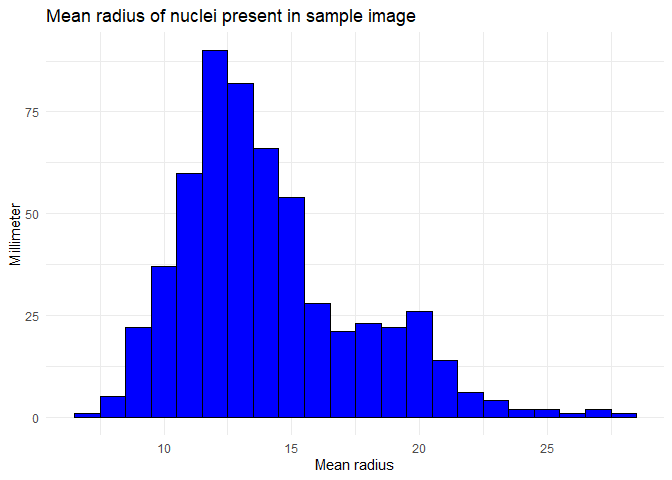
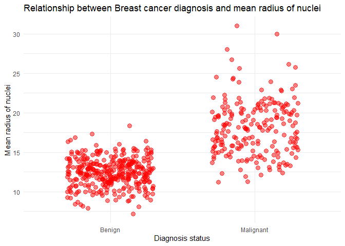

Mini Data-Analysis Deliverable-1
================

# Welcome to your (maybe) first-ever data analysis project!

And hopefully the first of many. Let’s get started:

1.  Install the [`datateachr`](https://github.com/UBC-MDS/datateachr)
    package by typing the following into your **R terminal**:

<!-- -->

    install.packages("devtools")
    devtools::install_github("UBC-MDS/datateachr")

2.  Load the packages below.

``` r
library(datateachr)
library(tidyverse)
```

    ## ── Attaching core tidyverse packages ──────────────────────── tidyverse 2.0.0 ──
    ## ✔ dplyr     1.1.2     ✔ readr     2.1.4
    ## ✔ forcats   1.0.0     ✔ stringr   1.5.0
    ## ✔ ggplot2   3.4.2     ✔ tibble    3.2.1
    ## ✔ lubridate 1.9.2     ✔ tidyr     1.3.0
    ## ✔ purrr     1.0.1     
    ## ── Conflicts ────────────────────────────────────────── tidyverse_conflicts() ──
    ## ✖ dplyr::filter() masks stats::filter()
    ## ✖ dplyr::lag()    masks stats::lag()
    ## ℹ Use the conflicted package (<http://conflicted.r-lib.org/>) to force all conflicts to become errors

3.  Make a repository in the <https://github.com/stat545ubc-2023>
    Organization. You can do this by following the steps found on canvas
    in the entry called [MDA: Create a
    repository](https://canvas.ubc.ca/courses/126199/pages/mda-create-a-repository).
    One completed, your repository should automatically be listed as
    part of the stat545ubc-2023 Organization.

# Instructions

## For Both Milestones

- Each milestone has explicit tasks. Tasks that are more challenging
  will often be allocated more points.

- Each milestone will be also graded for reproducibility, cleanliness,
  and coherence of the overall Github submission.

- While the two milestones will be submitted as independent
  deliverables, the analysis itself is a continuum - think of it as two
  chapters to a story. Each chapter, or in this case, portion of your
  analysis, should be easily followed through by someone unfamiliar with
  the content.
  [Here](https://swcarpentry.github.io/r-novice-inflammation/06-best-practices-R/)
  is a good resource for what constitutes “good code”. Learning good
  coding practices early in your career will save you hassle later on!

- The milestones will be equally weighted.

## For Milestone 1

**To complete this milestone**, edit [this very `.Rmd`
file](https://raw.githubusercontent.com/UBC-STAT/stat545.stat.ubc.ca/master/content/mini-project/mini-project-1.Rmd)
directly. Fill in the sections that are tagged with
`<!--- start your work below --->`.

**To submit this milestone**, make sure to knit this `.Rmd` file to an
`.md` file by changing the YAML output settings from
`output: html_document` to `output: github_document`. Commit and push
all of your work to the mini-analysis GitHub repository you made
earlier, and tag a release on GitHub. Then, submit a link to your tagged
release on canvas.

**Points**: This milestone is worth 36 points: 30 for your analysis, and
6 for overall reproducibility, cleanliness, and coherence of the Github
submission.

# Learning Objectives

By the end of this milestone, you should:

- Become familiar with your dataset of choosing
- Select 4 questions that you would like to answer with your data
- Generate a reproducible and clear report using R Markdown
- Become familiar with manipulating and summarizing your data in tibbles
  using `dplyr`, with a research question in mind.

# Task 1: Choose your favorite dataset

The `datateachr` package by Hayley Boyce and Jordan Bourak currently
composed of 7 semi-tidy datasets for educational purposes. Here is a
brief description of each dataset:

- *apt_buildings*: Acquired courtesy of The City of Toronto’s Open Data
  Portal. It currently has 3455 rows and 37 columns.

- *building_permits*: Acquired courtesy of The City of Vancouver’s Open
  Data Portal. It currently has 20680 rows and 14 columns.

- *cancer_sample*: Acquired courtesy of UCI Machine Learning Repository.
  It currently has 569 rows and 32 columns.

- *flow_sample*: Acquired courtesy of The Government of Canada’s
  Historical Hydrometric Database. It currently has 218 rows and 7
  columns.

- *parking_meters*: Acquired courtesy of The City of Vancouver’s Open
  Data Portal. It currently has 10032 rows and 22 columns.

- *steam_games*: Acquired courtesy of Kaggle. It currently has 40833
  rows and 21 columns.

- *vancouver_trees*: Acquired courtesy of The City of Vancouver’s Open
  Data Portal. It currently has 146611 rows and 20 columns.

**Things to keep in mind**

- We hope that this project will serve as practice for carrying our your
  own *independent* data analysis. Remember to comment your code, be
  explicit about what you are doing, and write notes in this markdown
  document when you feel that context is required. As you advance in the
  project, prompts and hints to do this will be diminished - it’ll be up
  to you!

- Before choosing a dataset, you should always keep in mind **your
  goal**, or in other ways, *what you wish to achieve with this data*.
  This mini data-analysis project focuses on *data wrangling*,
  *tidying*, and *visualization*. In short, it’s a way for you to get
  your feet wet with exploring data on your own.

And that is exactly the first thing that you will do!

1.1 **(1 point)** Out of the 7 datasets available in the `datateachr`
package, choose **4** that appeal to you based on their description.
Write your choices below:

**Note**: We encourage you to use the ones in the `datateachr` package,
but if you have a dataset that you’d really like to use, you can include
it here. But, please check with a member of the teaching team to see
whether the dataset is of appropriate complexity. Also, include a
**brief** description of the dataset here to help the teaching team
understand your data.

<!-------------------------- Start your work below ---------------------------->

1.  *cancer_sample*
2.  *vancouver_trees*
3.  *building_permits*
4.  *flow_sample*

<!----------------------------------------------------------------------------->

1.2 **(6 points)** One way to narrowing down your selection is to
*explore* the datasets. Use your knowledge of dplyr to find out at least
*3* attributes about each of these datasets (an attribute is something
such as number of rows, variables, class type…). The goal here is to
have an idea of *what the data looks like*.

*Hint:* This is one of those times when you should think about the
cleanliness of your analysis. I added a single code chunk for you below,
but do you want to use more than one? Would you like to write more
comments outside of the code chunk?

<!-------------------------- Start your work below ---------------------------->

``` r
### EXPLORE HERE ###
steam_games
```

    ## # A tibble: 40,833 × 21
    ##       id url    types name  desc_snippet recent_reviews all_reviews release_date
    ##    <dbl> <chr>  <chr> <chr> <chr>        <chr>          <chr>       <chr>       
    ##  1     1 https… app   DOOM  Now include… Very Positive… Very Posit… May 12, 2016
    ##  2     2 https… app   PLAY… PLAYERUNKNO… Mixed,(6,214)… Mixed,(836… Dec 21, 2017
    ##  3     3 https… app   BATT… Take comman… Mixed,(166),-… Mostly Pos… Apr 24, 2018
    ##  4     4 https… app   DayZ  The post-so… Mixed,(932),-… Mixed,(167… Dec 13, 2018
    ##  5     5 https… app   EVE … EVE Online … Mixed,(287),-… Mostly Pos… May 6, 2003 
    ##  6     6 https… bund… Gran… Grand Theft… NaN            NaN         NaN         
    ##  7     7 https… app   Devi… The ultimat… Very Positive… Very Posit… Mar 7, 2019 
    ##  8     8 https… app   Huma… Human: Fall… Very Positive… Very Posit… Jul 22, 2016
    ##  9     9 https… app   They… They Are Bi… Very Positive… Very Posit… Dec 12, 2017
    ## 10    10 https… app   Warh… In a world … <NA>           Mixed,(904… May 31, 2019
    ## # ℹ 40,823 more rows
    ## # ℹ 13 more variables: developer <chr>, publisher <chr>, popular_tags <chr>,
    ## #   game_details <chr>, languages <chr>, achievements <dbl>, genre <chr>,
    ## #   game_description <chr>, mature_content <chr>, minimum_requirements <chr>,
    ## #   recommended_requirements <chr>, original_price <dbl>, discount_price <dbl>

1.2.1. Finding the dimension (number of rows and columns) of each
dataset.

``` r
dim(cancer_sample)
```

    ## [1] 569  32

``` r
dim(vancouver_trees)
```

    ## [1] 146611     20

``` r
dim(building_permits)
```

    ## [1] 20680    14

``` r
dim(flow_sample)
```

    ## [1] 218   7

1.2.2. Finding the variable names in each dataset.

``` r
variable.names(cancer_sample)
```

    ##  [1] "ID"                      "diagnosis"              
    ##  [3] "radius_mean"             "texture_mean"           
    ##  [5] "perimeter_mean"          "area_mean"              
    ##  [7] "smoothness_mean"         "compactness_mean"       
    ##  [9] "concavity_mean"          "concave_points_mean"    
    ## [11] "symmetry_mean"           "fractal_dimension_mean" 
    ## [13] "radius_se"               "texture_se"             
    ## [15] "perimeter_se"            "area_se"                
    ## [17] "smoothness_se"           "compactness_se"         
    ## [19] "concavity_se"            "concave_points_se"      
    ## [21] "symmetry_se"             "fractal_dimension_se"   
    ## [23] "radius_worst"            "texture_worst"          
    ## [25] "perimeter_worst"         "area_worst"             
    ## [27] "smoothness_worst"        "compactness_worst"      
    ## [29] "concavity_worst"         "concave_points_worst"   
    ## [31] "symmetry_worst"          "fractal_dimension_worst"

``` r
variable.names(vancouver_trees)
```

    ##  [1] "tree_id"            "civic_number"       "std_street"        
    ##  [4] "genus_name"         "species_name"       "cultivar_name"     
    ##  [7] "common_name"        "assigned"           "root_barrier"      
    ## [10] "plant_area"         "on_street_block"    "on_street"         
    ## [13] "neighbourhood_name" "street_side_name"   "height_range_id"   
    ## [16] "diameter"           "curb"               "date_planted"      
    ## [19] "longitude"          "latitude"

``` r
variable.names(building_permits)
```

    ##  [1] "permit_number"               "issue_date"                 
    ##  [3] "project_value"               "type_of_work"               
    ##  [5] "address"                     "project_description"        
    ##  [7] "building_contractor"         "building_contractor_address"
    ##  [9] "applicant"                   "applicant_address"          
    ## [11] "property_use"                "specific_use_category"      
    ## [13] "year"                        "bi_id"

``` r
variable.names(flow_sample)
```

    ## [1] "station_id"   "year"         "extreme_type" "month"        "day"         
    ## [6] "flow"         "sym"

1.2.3. Finding the class type of each dataset.

``` r
class(cancer_sample)
```

    ## [1] "spec_tbl_df" "tbl_df"      "tbl"         "data.frame"

``` r
class(vancouver_trees)
```

    ## [1] "tbl_df"     "tbl"        "data.frame"

``` r
class(building_permits)
```

    ## [1] "spec_tbl_df" "tbl_df"      "tbl"         "data.frame"

``` r
class(flow_sample)
```

    ## [1] "tbl_df"     "tbl"        "data.frame"

1.2.4. Finding the more information of each dataset as the summary.

``` r
summary(cancer_sample)
```

    ##        ID             diagnosis          radius_mean      texture_mean  
    ##  Min.   :     8670   Length:569         Min.   : 6.981   Min.   : 9.71  
    ##  1st Qu.:   869218   Class :character   1st Qu.:11.700   1st Qu.:16.17  
    ##  Median :   906024   Mode  :character   Median :13.370   Median :18.84  
    ##  Mean   : 30371831                      Mean   :14.127   Mean   :19.29  
    ##  3rd Qu.:  8813129                      3rd Qu.:15.780   3rd Qu.:21.80  
    ##  Max.   :911320502                      Max.   :28.110   Max.   :39.28  
    ##  perimeter_mean     area_mean      smoothness_mean   compactness_mean 
    ##  Min.   : 43.79   Min.   : 143.5   Min.   :0.05263   Min.   :0.01938  
    ##  1st Qu.: 75.17   1st Qu.: 420.3   1st Qu.:0.08637   1st Qu.:0.06492  
    ##  Median : 86.24   Median : 551.1   Median :0.09587   Median :0.09263  
    ##  Mean   : 91.97   Mean   : 654.9   Mean   :0.09636   Mean   :0.10434  
    ##  3rd Qu.:104.10   3rd Qu.: 782.7   3rd Qu.:0.10530   3rd Qu.:0.13040  
    ##  Max.   :188.50   Max.   :2501.0   Max.   :0.16340   Max.   :0.34540  
    ##  concavity_mean    concave_points_mean symmetry_mean    fractal_dimension_mean
    ##  Min.   :0.00000   Min.   :0.00000     Min.   :0.1060   Min.   :0.04996       
    ##  1st Qu.:0.02956   1st Qu.:0.02031     1st Qu.:0.1619   1st Qu.:0.05770       
    ##  Median :0.06154   Median :0.03350     Median :0.1792   Median :0.06154       
    ##  Mean   :0.08880   Mean   :0.04892     Mean   :0.1812   Mean   :0.06280       
    ##  3rd Qu.:0.13070   3rd Qu.:0.07400     3rd Qu.:0.1957   3rd Qu.:0.06612       
    ##  Max.   :0.42680   Max.   :0.20120     Max.   :0.3040   Max.   :0.09744       
    ##    radius_se        texture_se      perimeter_se       area_se       
    ##  Min.   :0.1115   Min.   :0.3602   Min.   : 0.757   Min.   :  6.802  
    ##  1st Qu.:0.2324   1st Qu.:0.8339   1st Qu.: 1.606   1st Qu.: 17.850  
    ##  Median :0.3242   Median :1.1080   Median : 2.287   Median : 24.530  
    ##  Mean   :0.4052   Mean   :1.2169   Mean   : 2.866   Mean   : 40.337  
    ##  3rd Qu.:0.4789   3rd Qu.:1.4740   3rd Qu.: 3.357   3rd Qu.: 45.190  
    ##  Max.   :2.8730   Max.   :4.8850   Max.   :21.980   Max.   :542.200  
    ##  smoothness_se      compactness_se      concavity_se     concave_points_se 
    ##  Min.   :0.001713   Min.   :0.002252   Min.   :0.00000   Min.   :0.000000  
    ##  1st Qu.:0.005169   1st Qu.:0.013080   1st Qu.:0.01509   1st Qu.:0.007638  
    ##  Median :0.006380   Median :0.020450   Median :0.02589   Median :0.010930  
    ##  Mean   :0.007041   Mean   :0.025478   Mean   :0.03189   Mean   :0.011796  
    ##  3rd Qu.:0.008146   3rd Qu.:0.032450   3rd Qu.:0.04205   3rd Qu.:0.014710  
    ##  Max.   :0.031130   Max.   :0.135400   Max.   :0.39600   Max.   :0.052790  
    ##   symmetry_se       fractal_dimension_se  radius_worst   texture_worst  
    ##  Min.   :0.007882   Min.   :0.0008948    Min.   : 7.93   Min.   :12.02  
    ##  1st Qu.:0.015160   1st Qu.:0.0022480    1st Qu.:13.01   1st Qu.:21.08  
    ##  Median :0.018730   Median :0.0031870    Median :14.97   Median :25.41  
    ##  Mean   :0.020542   Mean   :0.0037949    Mean   :16.27   Mean   :25.68  
    ##  3rd Qu.:0.023480   3rd Qu.:0.0045580    3rd Qu.:18.79   3rd Qu.:29.72  
    ##  Max.   :0.078950   Max.   :0.0298400    Max.   :36.04   Max.   :49.54  
    ##  perimeter_worst    area_worst     smoothness_worst  compactness_worst
    ##  Min.   : 50.41   Min.   : 185.2   Min.   :0.07117   Min.   :0.02729  
    ##  1st Qu.: 84.11   1st Qu.: 515.3   1st Qu.:0.11660   1st Qu.:0.14720  
    ##  Median : 97.66   Median : 686.5   Median :0.13130   Median :0.21190  
    ##  Mean   :107.26   Mean   : 880.6   Mean   :0.13237   Mean   :0.25427  
    ##  3rd Qu.:125.40   3rd Qu.:1084.0   3rd Qu.:0.14600   3rd Qu.:0.33910  
    ##  Max.   :251.20   Max.   :4254.0   Max.   :0.22260   Max.   :1.05800  
    ##  concavity_worst  concave_points_worst symmetry_worst   fractal_dimension_worst
    ##  Min.   :0.0000   Min.   :0.00000      Min.   :0.1565   Min.   :0.05504        
    ##  1st Qu.:0.1145   1st Qu.:0.06493      1st Qu.:0.2504   1st Qu.:0.07146        
    ##  Median :0.2267   Median :0.09993      Median :0.2822   Median :0.08004        
    ##  Mean   :0.2722   Mean   :0.11461      Mean   :0.2901   Mean   :0.08395        
    ##  3rd Qu.:0.3829   3rd Qu.:0.16140      3rd Qu.:0.3179   3rd Qu.:0.09208        
    ##  Max.   :1.2520   Max.   :0.29100      Max.   :0.6638   Max.   :0.20750

``` r
summary(vancouver_trees)
```

    ##     tree_id        civic_number    std_street         genus_name       
    ##  Min.   :    12   Min.   :    0   Length:146611      Length:146611     
    ##  1st Qu.: 65464   1st Qu.: 1306   Class :character   Class :character  
    ##  Median :134903   Median : 2604   Mode  :character   Mode  :character  
    ##  Mean   :131892   Mean   : 2937                                        
    ##  3rd Qu.:194450   3rd Qu.: 4005                                        
    ##  Max.   :266203   Max.   :17888                                        
    ##                                                                        
    ##  species_name       cultivar_name      common_name          assigned        
    ##  Length:146611      Length:146611      Length:146611      Length:146611     
    ##  Class :character   Class :character   Class :character   Class :character  
    ##  Mode  :character   Mode  :character   Mode  :character   Mode  :character  
    ##                                                                             
    ##                                                                             
    ##                                                                             
    ##                                                                             
    ##  root_barrier        plant_area        on_street_block  on_street        
    ##  Length:146611      Length:146611      Min.   :   0    Length:146611     
    ##  Class :character   Class :character   1st Qu.:1300    Class :character  
    ##  Mode  :character   Mode  :character   Median :2600    Mode  :character  
    ##                                        Mean   :2909                      
    ##                                        3rd Qu.:4000                      
    ##                                        Max.   :9900                      
    ##                                                                          
    ##  neighbourhood_name street_side_name   height_range_id     diameter     
    ##  Length:146611      Length:146611      Min.   : 0.000   Min.   :  0.00  
    ##  Class :character   Class :character   1st Qu.: 1.000   1st Qu.:  3.50  
    ##  Mode  :character   Mode  :character   Median : 2.000   Median :  9.00  
    ##                                        Mean   : 2.627   Mean   : 11.49  
    ##                                        3rd Qu.: 4.000   3rd Qu.: 16.50  
    ##                                        Max.   :10.000   Max.   :435.00  
    ##                                                                         
    ##      curb            date_planted          longitude         latitude    
    ##  Length:146611      Min.   :1989-10-27   Min.   :-123.2   Min.   :49.20  
    ##  Class :character   1st Qu.:1998-02-23   1st Qu.:-123.1   1st Qu.:49.23  
    ##  Mode  :character   Median :2004-01-28   Median :-123.1   Median :49.25  
    ##                     Mean   :2004-04-07   Mean   :-123.1   Mean   :49.25  
    ##                     3rd Qu.:2010-03-02   3rd Qu.:-123.1   3rd Qu.:49.26  
    ##                     Max.   :2019-07-03   Max.   :-123.0   Max.   :49.29  
    ##                     NA's   :76548        NA's   :22771    NA's   :22771

``` r
summary(building_permits)
```

    ##  permit_number        issue_date         project_value       type_of_work      
    ##  Length:20680       Min.   :2017-01-03   Min.   :        0   Length:20680      
    ##  Class :character   1st Qu.:2017-09-25   1st Qu.:    10739   Class :character  
    ##  Mode  :character   Median :2018-07-18   Median :    48000   Mode  :character  
    ##                     Mean   :2018-07-24   Mean   :   609166                     
    ##                     3rd Qu.:2019-05-13   3rd Qu.:   217791                     
    ##                     Max.   :2020-04-29   Max.   :807185500                     
    ##                                          NA's   :52                            
    ##    address          project_description building_contractor
    ##  Length:20680       Length:20680        Length:20680       
    ##  Class :character   Class :character    Class :character   
    ##  Mode  :character   Mode  :character    Mode  :character   
    ##                                                            
    ##                                                            
    ##                                                            
    ##                                                            
    ##  building_contractor_address  applicant         applicant_address 
    ##  Length:20680                Length:20680       Length:20680      
    ##  Class :character            Class :character   Class :character  
    ##  Mode  :character            Mode  :character   Mode  :character  
    ##                                                                   
    ##                                                                   
    ##                                                                   
    ##                                                                   
    ##  property_use       specific_use_category      year          bi_id      
    ##  Length:20680       Length:20680          Min.   :2017   Min.   :    1  
    ##  Class :character   Class :character      1st Qu.:2017   1st Qu.: 5171  
    ##  Mode  :character   Mode  :character      Median :2018   Median :10340  
    ##                                           Mean   :2018   Mean   :10340  
    ##                                           3rd Qu.:2019   3rd Qu.:15510  
    ##                                           Max.   :2020   Max.   :20680  
    ## 

``` r
summary(flow_sample)
```

    ##   station_id             year      extreme_type           month       
    ##  Length:218         Min.   :1909   Length:218         Min.   : 1.000  
    ##  Class :character   1st Qu.:1936   Class :character   1st Qu.: 3.000  
    ##  Mode  :character   Median :1963   Mode  :character   Median : 6.000  
    ##                     Mean   :1963                      Mean   : 5.046  
    ##                     3rd Qu.:1990                      3rd Qu.: 6.000  
    ##                     Max.   :2018                      Max.   :12.000  
    ##                                                       NA's   :2       
    ##       day             flow            sym           
    ##  Min.   : 1.00   Min.   :  3.62   Length:218        
    ##  1st Qu.: 8.00   1st Qu.:  6.18   Class :character  
    ##  Median :17.00   Median :114.00   Mode  :character  
    ##  Mean   :16.24   Mean   :110.13                     
    ##  3rd Qu.:25.00   3rd Qu.:204.25                     
    ##  Max.   :31.00   Max.   :466.00                     
    ##  NA's   :2       NA's   :2

1.2.5. Finally load the dataset.

``` r
data("cancer_sample")
data("vancouver_trees")
data("building_permits")
data("flow_sample")
```

<!----------------------------------------------------------------------------->

1.3 **(1 point)** Now that you’ve explored the 4 datasets that you were
initially most interested in, let’s narrow it down to 1. What lead you
to choose this one? Briefly explain your choice below.

<!-------------------------- Start your work below ---------------------------->

My choice is ***cancer_sample*** dataset; This data set contains a
sample of quantitative features that were calculated from images of
nuclei present in fine needle aspiration biopsies of breast masses from
patients at the [University of Wisconsin
Hospital](https://www.uwhealth.org/). The reason I’ve chosen this
dataset is that I’ve had a personal experience with the loss of my
grandmother to [Breast
Cancer](https://cancer.ca/en/ways-to-give/breast-cancer-awareness-month)
as well as October is ***National Breast Cancer Awareness Month*** in
`Canada`, and it’s the current month, I am working on this
dataset.
<!----------------------------------------------------------------------------->

1.4 **(2 points)** Time for a final decision! Going back to the
beginning, it’s important to have an *end goal* in mind. For example, if
I had chosen the `titanic` dataset for my project, I might’ve wanted to
explore the relationship between survival and other variables. Try to
think of 1 research question that you would want to answer with your
dataset. Note it down below.

<!-------------------------- Start your work below ---------------------------->

##### **My main question:** Association between diagnosis status ( **malignant** or **benign**) and other variables in this dataset.


<!----------------------------------------------------------------------------->

# Important note

Read Tasks 2 and 3 *fully* before starting to complete either of them.
Probably also a good point to grab a coffee to get ready for the fun
part!

This project is semi-guided, but meant to be *independent*. For this
reason, you will complete tasks 2 and 3 below (under the **START HERE**
mark) as if you were writing your own exploratory data analysis report,
and this guidance never existed! Feel free to add a brief introduction
section to your project, format the document with markdown syntax as you
deem appropriate, and structure the analysis as you deem appropriate. If
you feel lost, you can find a sample data analysis
[here](https://www.kaggle.com/headsortails/tidy-titarnic) to have a
better idea. However, bear in mind that it is **just an example** and
you will not be required to have that level of complexity in your
project.

# Task 2: Exploring your dataset

If we rewind and go back to the learning objectives, you’ll see that by
the end of this deliverable, you should have formulated *4* research
questions about your data that you may want to answer during your
project. However, it may be handy to do some more exploration on your
dataset of choice before creating these questions - by looking at the
data, you may get more ideas. **Before you start this task, read all
instructions carefully until you reach START HERE under Task 3**.

2.1 **(12 points)** Complete *4 out of the following 8 exercises* to
dive deeper into your data. All datasets are different and therefore,
not all of these tasks may make sense for your data - which is why you
should only answer *4*.

Make sure that you’re using dplyr and ggplot2 rather than base R for
this task. Outside of this project, you may find that you prefer using
base R functions for certain tasks, and that’s just fine! But part of
this project is for you to practice the tools we learned in class, which
is dplyr and ggplot2.

1.  Plot the distribution of a numeric variable.

***Introduction:*** I would like to have the plot of the mean radius of
nuclei present in sample image to see the distribution of the radius in
all specimens.

``` r
library(ggplot2)  # unloading the package for making plot.
library(dplyr) # Unloading this package for data manipulation.
```

``` r
dataset <- cancer_sample  # Assigning the 'cancer_sample' dataset to simply 'dataset' for convenience.
```

``` r
ggplot(dataset, aes(x= radius_mean)) +
  geom_histogram(binwidth = 1, fill = "blue", color = "black") +
  labs(title = "Mean radius of nuclei present in sample image", x = "Mean radius", y = "Count") +
  theme_minimal()
```

<!-- -->

2.  Create a new variable based on other variables in your data (only if
    it makes sense).

***Introduction:*** In this dataset, it appears that each patient has
multiple images of nuclei present in fine needle aspiration biopsies of
breast cancer. Consequently, for each variable, I observe both the
**mean** and the **standard error**. Therefore, I would like to generate
a new type of variable that combines these two measurements. I refer to
this variable as a **real_variable** because it incorporates both the
mean and the standard error. Additionally, in the diagnosis variable,
“B” stands for *benign*, and “M” is the abbreviation for *malignant*. I
intend to include the full names in the new dataset.

Therefore, I will henceforth refer to as the `real_dataset`.

``` r
real_dataset <- dataset %>%
  mutate(
    real_radius_mean = radius_mean + radius_se,
    real_texture_mean = texture_mean + texture_se,
    real_perimeter_mean = perimeter_mean + perimeter_se,
    real_area_mean = area_mean + area_se,
    real_smoothness_mean = smoothness_mean + smoothness_se,
    real_compactness_mean = compactness_mean + compactness_se,
    real_concavity_mean = concavity_mean + concavity_se,
    real_concave_point_mean = concave_points_mean + concave_points_se,
    real_symmetry_mean = symmetry_mean + symmetry_se,
    real_fractal_dimension_mean = fractal_dimension_mean + fractal_dimension_se) %>%
  mutate(diagnosis = ifelse(diagnosis == "B", "Benign", ifelse(diagnosis == "M", "Malignant", diagnosis)))
```

3.  Investigate how many missing values there are per variable. Can you
    find a way to plot this?

4.  Explore the relationship between 2 variables in a plot.

***Introduction:*** The samples are divided into two groups based on the
diagnosis: malignant and benign. Therefore, I would like to explore the
differences between *diagnosis* and *real_radius-mean* through a jitter
plot.

``` r
ggplot(real_dataset, aes(x = diagnosis, y = real_radius_mean)) +
  geom_jitter(width = 0.3, size = 3, alpha = 0.5, shape = 19, color = "red") +
  labs(title = "Relationship between Breast cancer diagnosis and mean radius of nuclei", x = "Diagnosis status", y = "Mean radius of nuclei") +
  theme_minimal()
```

<!-- -->

5.  Filter observations in your data according to your own criteria.
    Think of what you’d like to explore - again, if this was the
    `titanic` dataset, I may want to narrow my search down to passengers
    born in a particular year…
6.  Use a boxplot to look at the frequency of different observations
    within a single variable. You can do this for more than one variable
    if you wish!
7.  Make a new tibble with a subset of your data, with variables and
    observations that you are interested in exploring.

***Introduction:*** I have created a new tibble containing data for the
worst malignant patients. Malignant status represents the most severe
form of cancer; therefore, analyzing the variables containing the worst
features (e.g., `radius_worst`, `texture_worst`, `perimeter_worst`, so
on)in malignant samples is of particular interest to me.

``` r
Malignant_worst_data <- real_dataset %>%
  select(
    ID,
    diagnosis,
    radius_worst,
    texture_worst,
    perimeter_worst,
    area_worst,
    smoothness_worst,
    compactness_worst,
    concavity_worst,
    concave_points_worst,
    symmetry_worst,
    fractal_dimension_worst) %>%
  filter(diagnosis == "Malignant") 
```

8.  Use a density plot to explore any of your variables (that are
    suitable for this type of plot).

2.2 **(4 points)** For each of the 4 exercises that you complete,
provide a *brief explanation* of why you chose that exercise in relation
to your data (in other words, why does it make sense to do that?), and
sufficient comments for a reader to understand your reasoning and code.

<!-------------------------- Start your work below ---------------------------->

##### Question 1. Plot the distribution of a numeric variable.

*Comment:* I would like to analyze the plot of the mean radius of nuclei
present in the sample image to observe the distribution of radii across
all specimens. This analysis is crucial as it allows us to gain a better
understanding of the variations in nuclei sizes within the dataset. By
examining the distribution, we can identify any trends or anomalies,
which can provide valuable insights for further research or diagnostic
purposes. Additionally, this information aids in characterizing the
dataset and can potentially lead to important findings in the study of
nuclei characteristics. Based on the plot, we can see most of the
samples have `mean_radius` between 10 to 15.

##### Question 2. Create a new variable based on other variables in your data (only if it makes sense).

*Comment:* In this dataset, it appears that each patient has multiple
images of nuclei present in fine needle aspiration biopsies of breast
cancer. Consequently, for each variable, I observe both the **mean** and
the **standard error**. Therefore, I would like to generate a new type
of variable that combines these two measurements. I refer to this
variable as a **real_variable** because it incorporates both the mean
and the standard error. Additionally, in the diagnosis variable, “B”
stands for *benign*, and “M” is the abbreviation for *malignant*. I
intend to include the full names in the new dataset. Therefore, I will
henceforth refer to as the `real_dataset`.

##### Question 3. Explore the relationship between 2 variables in a plot.

*Comment:* I would liked to find relationship between `_diagnosis_` and
`_real_radius-mean_` though *jitter* to see can I see any association
between the mean of the radius with cancer status(malignancy/benign).
Therefore, I made a jitter plot to see better this difference so that
*generally speaking* you can see malignant specimens have higher
`_real_radius-mean_` than benign specimens.

##### Question 7. Make a new tibble with a subset of your data, with variables and observations that you are interested in exploring.

*Comment:* Based on a comprehensive review
[paper](https://www.ncbi.nlm.nih.gov/pmc/articles/PMC5715522/) The worst
condition in breast cancer typically corresponds to a higher malignancy
status, indicating more aggressive and potentially life-threatening
cancer. Therefore, I produced this subset for further analysis; I only
selected malignant specimens from the diagnosis column and variables
related to the worst conditions.

<!----------------------------------------------------------------------------->

# Task 3: Choose research questions

**(4 points)** So far, you have chosen a dataset and gotten familiar
with it through exploring the data. You have also brainstormed one
research question that interested you (Task 1.4). Now it’s time to pick
4 research questions that you would like to explore in Milestone 2!
Write the 4 questions and any additional comments below.

<!--- *****START HERE***** --->

##### My questions are:

> Question 1. Does the mean compactness of nuclei present in a sample
> image differ between malignant diagnosis samples and benign diagnosis
> samples?

> Question 2. Is there a difference in the mean perimeter of nuclei
> present in a sample image between malignant diagnosis samples and
> benign diagnosis samples?

> Question 3. Do malignant samples have the largest perimeter of nuclei
> present in the sample image compared to the benign samples?

> Question 4. In malignant samples, is there any association between the
> largest compactness of nuclei and the largest smoothness of nuclei?
> <!----------------------------->

# Overall reproducibility/Cleanliness/Coherence Checklist

## Coherence (0.5 points)

The document should read sensibly from top to bottom, with no major
continuity errors. An example of a major continuity error is having a
data set listed for Task 3 that is not part of one of the data sets
listed in Task 1.

## Error-free code (3 points)

For full marks, all code in the document should run without error. 1
point deduction if most code runs without error, and 2 points deduction
if more than 50% of the code throws an error.

## Main README (1 point)

There should be a file named `README.md` at the top level of your
repository. Its contents should automatically appear when you visit the
repository on GitHub.

Minimum contents of the README file:

- In a sentence or two, explains what this repository is, so that
  future-you or someone else stumbling on your repository can be
  oriented to the repository.
- In a sentence or two (or more??), briefly explains how to engage with
  the repository. You can assume the person reading knows the material
  from STAT 545A. Basically, if a visitor to your repository wants to
  explore your project, what should they know?

Once you get in the habit of making README files, and seeing more README
files in other projects, you’ll wonder how you ever got by without them!
They are tremendously helpful.

## Output (1 point)

All output is readable, recent and relevant:

- All Rmd files have been `knit`ted to their output md files.
- All knitted md files are viewable without errors on Github. Examples
  of errors: Missing plots, “Sorry about that, but we can’t show files
  that are this big right now” messages, error messages from broken R
  code
- All of these output files are up-to-date – that is, they haven’t
  fallen behind after the source (Rmd) files have been updated.
- There should be no relic output files. For example, if you were
  knitting an Rmd to html, but then changed the output to be only a
  markdown file, then the html file is a relic and should be deleted.

(0.5 point deduction if any of the above criteria are not met. 1 point
deduction if most or all of the above criteria are not met.)

Our recommendation: right before submission, delete all output files,
and re-knit each milestone’s Rmd file, so that everything is up to date
and relevant. Then, after your final commit and push to Github, CHECK on
Github to make sure that everything looks the way you intended!

## Tagged release (0.5 points)

You’ve tagged a release for Milestone 1.

### Attribution

Thanks to Icíar Fernández Boyano for mostly putting this together, and
Vincenzo Coia for launching.
